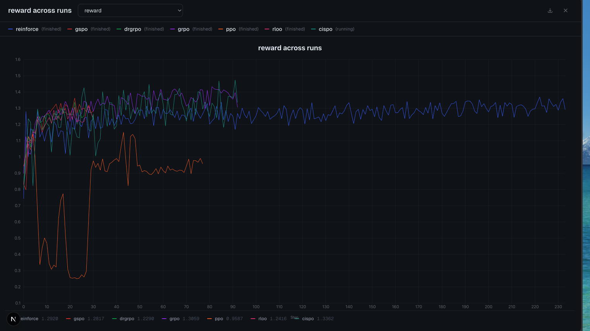
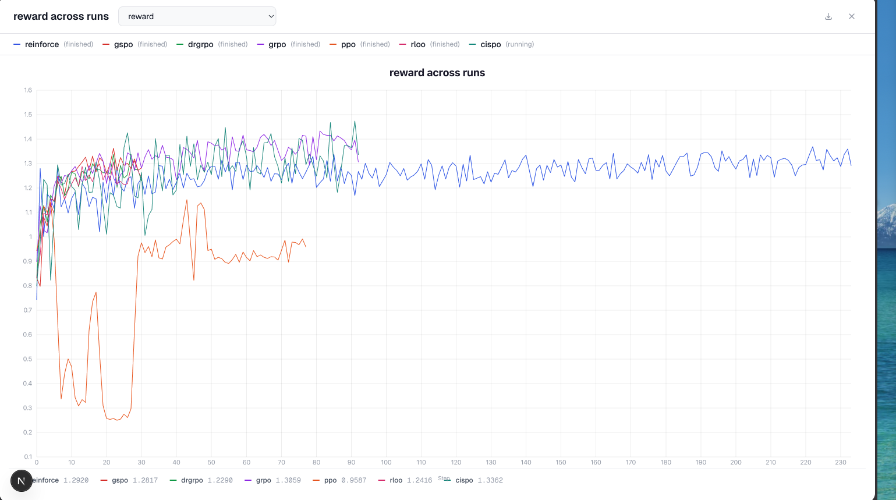
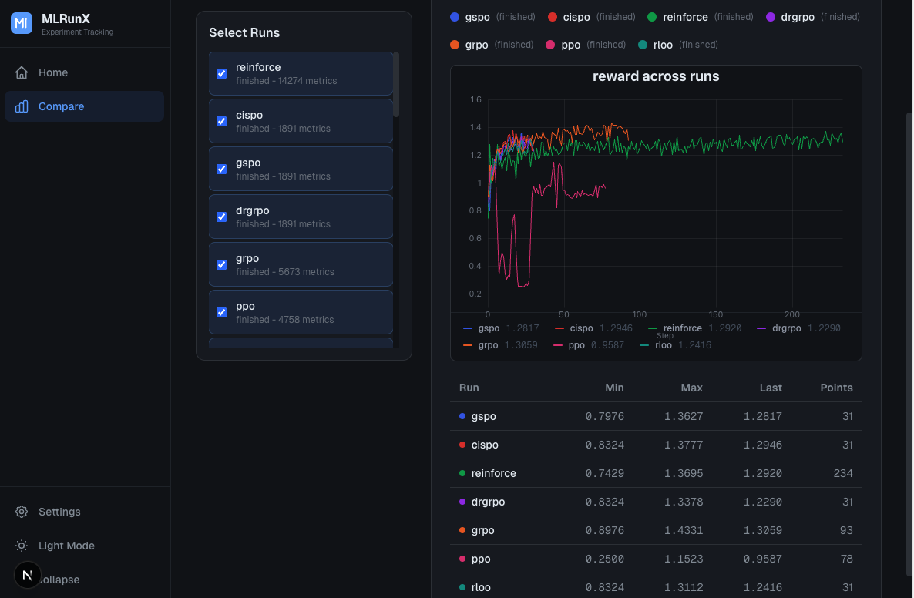

<p align="center">
  <picture>
    <source media="(prefers-color-scheme: dark)" srcset="docs/mlrunx-logo-dark.svg">
    <source media="(prefers-color-scheme: light)" srcset="docs/mlrunx-logo-light.svg">
    
  </picture>
</p>

<h3 align="center"><b>Open-Source ML Experiment Tracking</b></h3>

<p align="center">
  <a href="https://deepwiki.com/ibusnowden/MLRunX">Documentation</a> &middot;
  <a href="https://github.com/ibusnowden/MLRunX/releases">Releases</a> &middot;
  <a href="https://github.com/ibusnowden/MLRunX">GitHub</a>
</p>

<br/>

<p align="center">
  <a href="https://github.com/ibusnowden/MLRunX/actions/workflows/ci.yml">
    
  </a>
  <a href="https://github.com/ibusnowden/MLRunX/actions/workflows/release.yml">
    
  </a>
  <a href="https://github.com/ibusnowden/MLRunX/releases/tag/v0.1.0">
    
  </a>
  <a href="LICENSE">
    
  </a>
</p>

<br/>

## News & Updates

- **[02/07/26]** `v0.1.0` is released, featuring the Rust API gateway (Axum + SQLite), Next.js dashboard with dark/light theming, project-scoped API keys, role-based access control, shareable view-only links, key management API, Docker image, and GitHub Actions CI/CD.

---

## Preview

> Compare reward curves across RL training runs -- REINFORCE, GSPO, GRPO, PPO, RLOO, CISPO and more.

<p align="center">
  
</p>
<p align="center"><em>Expanded compare chart — Light mode</em></p>

<br/>

<p align="center">
  
</p>
<p align="center"><em>Full compare dashboard with run selector and statistics — Dark mode</em></p>

<br/>

<p align="center">
  
</p>
<p align="center"><em>Expanded compare chart — Dark mode</em></p>

---

## Why MLRunX?

- **Performance-first**: Rust API gateway with sub-second responses, designed to scale to 10k+ runs
- **AI-native**: Built for RL/LLM training workflows with multi-run comparison and system metric overlays
- **Local-first**: Single binary + SQLite, no external databases required. Privacy-first, no vendor lock-in
- **Open**: MIT licensed, fully open-source

## Architecture (v0.1)

The current release uses a lightweight, self-contained architecture:

```
┌─────────────┐     ┌──────────────────┐     ┌─────────────────┐
│  Python SDK │────▶│   API Gateway    │────▶│     SQLite      │
│  (async +   │     │  (Rust / Axum)   │     │   (all data)    │
│   batching) │     │  HTTP + gRPC     │     └─────────────────┘
└─────────────┘     └──────────────────┘
                           ▲
                           │
                    ┌──────────────────┐
                    │   Next.js UI     │
                    │  (TypeScript)    │
                    └──────────────────┘
```

<details>
<summary><b>Planned: Scale-out architecture</b></summary>

The codebase includes scaffolded storage backends (ClickHouse, PostgreSQL, MinIO) and
service skeletons (ingest, processor) for a future distributed deployment:

```
┌─────────────┐     ┌─────────────┐     ┌─────────────────┐
│  Python SDK │────▶│   Ingest    │────▶│   ClickHouse    │
│  (async +   │     │  (Rust/gRPC)│     │  (metrics/traces)│
│   spool)    │     └─────────────┘     └─────────────────┘
└─────────────┘            │
                           ▼
┌─────────────┐     ┌─────────────┐     ┌─────────────────┐
│   Next.js   │◀───▶│  API Gateway│◀───▶│    Postgres     │
│     UI      │     │  (Rust/Axum)│     │   (metadata)    │
└─────────────┘     └─────────────┘     └─────────────────┘
                           │
                           ▼
                    ┌─────────────┐     ┌─────────────────┐
                    │  Processor  │     │     MinIO       │
                    │  (rollups)  │     │   (artifacts)   │
                    └─────────────┘     └─────────────────┘
```

The Docker Compose stack at `infra/docker/` already provisions ClickHouse, Postgres,
MinIO, Redis, and an OTEL collector for when these backends are wired in.

</details>

## Features (v0.1.0)

| Feature | Status |
|---------|--------|
| Rust API gateway (Axum + gRPC) | Shipped |
| SQLite storage (runs, metrics, keys, share tokens) | Shipped |
| Next.js dashboard with dark/light themes | Shipped |
| Multi-run comparison with interactive charts | Shipped |
| System metrics (CPU, memory, GPU, disk, network) | Shipped |
| Project-scoped API keys | Shipped |
| Role-based access control (admin / write / read) | Shipped |
| Key management API (create / list / revoke) | Shipped |
| Shareable view-only links (with optional expiry) | Shipped |
| Standalone Docker image | Shipped |
| GitHub Actions CI/CD (build, test, release) | Shipped |
| Python SDK (async batching + offline spool) | Beta |
| Framework integrations (Lightning, HF, Optuna) | Scaffolded |
| ClickHouse / Postgres / MinIO backends | Scaffolded |
| Distributed ingest + processor services | Scaffolded |

## Project Structure

```
MLRunX/
├── apps/
│   ├── api/                # Rust API gateway (Axum + gRPC + SQLite)
│   └── ui/                 # Next.js dashboard (TypeScript + Tailwind)
├── sdks/
│   ├── python/             # Python SDK (async batching + offline spool)
│   └── integrations/       # Lightning, Hydra, Optuna, HuggingFace hooks
├── services/
│   ├── ingest/             # [scaffold] Rust ingest service
│   └── processor/          # [scaffold] Rollups, downsampling
├── crates/
│   └── proto/              # Protobuf definitions + generated code
├── infra/
│   ├── docker/             # Docker Compose stack (CH, PG, MinIO, Redis)
│   ├── k8s/                # Kubernetes manifests
│   └── observability/      # OpenTelemetry collector config
├── docs/                   # Architecture, specs, operations guides
├── bench/                  # Benchmark scripts + CI thresholds
├── migrations/
│   ├── clickhouse/         # ClickHouse schema migrations
│   ├── postgres/           # Postgres schema migrations
│   ├── wandb/              # [placeholder] W&B import tools
│   └── mlflow/             # [placeholder] MLflow adapters
├── proto/                  # .proto source files
├── tests/                  # Contract, integration, unit tests
├── Dockerfile              # Standalone SQLite deployment image
├── Cargo.toml              # Rust workspace manifest
├── Makefile                # Build automation
└── pyproject.toml          # Python project config
```

## Tech Stack

| Component | Technology | Status |
|-----------|------------|--------|
| **API Gateway** | Rust + Axum (HTTP) + Tonic (gRPC) | Active |
| **Storage** | SQLite (runs, metrics, API keys, share tokens) | Active |
| **Dashboard** | Next.js 16 + TypeScript + Tailwind CSS v4 | Active |
| **Charts** | uPlot (high-performance time series) | Active |
| **Python SDK** | Python 3.10+ (async, httpx, pydantic) | Beta |
| **Metrics Storage** | ClickHouse | Scaffolded |
| **Metadata Store** | PostgreSQL | Scaffolded |
| **Artifact Storage** | MinIO (S3-compatible) | Scaffolded |
| **Observability** | OpenTelemetry | Scaffolded |

## Quick Start

### Option A: Standalone binary (simplest)

```bash
# Clone and build
git clone https://github.com/ibusnowden/MLRunX.git
cd MLRunX

# Start the API (SQLite, zero dependencies)
cargo run --bin mlrunx-api
# → HTTP on :3001, gRPC on :50051, SQLite at ./mlrunx.db

# Start the UI (in another terminal)
cd apps/ui && npm install && npm run dev
# → Dashboard on http://localhost:3000
```

### Option B: Docker

```bash
# Pull and run the pre-built image
docker run -p 3001:3001 -p 50051:50051 -v mlrunx-data:/data \
  ghcr.io/ibusnowden/mlrunx:latest

# Or build locally
docker build -t mlrunx .
docker run -p 3001:3001 -p 50051:50051 -v mlrunx-data:/data mlrunx
```

### Option C: Full Docker Compose stack (for development)

```bash
# Starts ClickHouse, Postgres, MinIO, Redis, OTEL collector, API, and UI
cd infra/docker
cp .env.example .env    # review and edit secrets
docker compose up -d
```

### Services & Ports

| Service | Port | Description |
|---------|------|-------------|
| **API** | 3001 (HTTP), 50051 (gRPC) | Rust API gateway |
| **UI** | 3000 | Next.js dashboard |

<details>
<summary>Full Docker Compose stack ports</summary>

| Service | Port | Description |
|---------|------|-------------|
| **ClickHouse** | 8123 (HTTP), 9000 (TCP) | Metrics storage (scaffolded) |
| **PostgreSQL** | 5432 | Metadata storage (scaffolded) |
| **MinIO** | 9001 (API), 9002 (Console) | Artifact storage (scaffolded) |
| **Redis** | 6379 | Queue and cache (scaffolded) |
| **OTEL Collector** | 4317 (gRPC), 4318 (HTTP) | Telemetry collection |

</details>

### API Authentication

```bash
# Disable auth for local development
MLRUNX_AUTH_DISABLED=true cargo run --bin mlrunx-api

# Or use an admin API key to create scoped keys
curl -X POST http://localhost:3001/api/v1/keys \
  -H "X-API-Key: $ADMIN_KEY" \
  -H "Content-Type: application/json" \
  -d '{"name": "team-alpha", "project_id": "my-project", "scope": "write"}'
```

### Development Setup

```bash
# Clone the repo
git clone https://github.com/ibusnowden/MLRunX.git
cd MLRunX

# Rust API
cargo check
cargo run --bin mlrunx-api

# UI development
cd apps/ui && npm install && npm run dev

# Python SDK development
cd sdks/python
uv sync --all-packages
source .venv/bin/activate
```

## SDK Usage (Beta)

```python
import mlrunx

# Initialize a run
run = mlrunx.init(project_id="my-project", name="training-run-1")

# Log metrics (async, batched automatically)
for step in range(1000):
    run.log({"loss": loss, "accuracy": acc}, step=step)

# Log artifacts
run.log_artifact("model.pt", type="model")

# Finish
run.finish()
```

## Integrations (Scaffolded)

```python
# PyTorch Lightning
from mlrunx.integrations import TrackLogger
trainer = Trainer(logger=TrackLogger())

# HuggingFace Transformers
from mlrunx.integrations import TrackCallback
trainer.add_callback(TrackCallback())

# Optuna
from mlrunx.integrations import TrackOptunaCallback
study.optimize(objective, callbacks=[TrackOptunaCallback()])
```

## Roadmap 2026

### Phase 1: MVP + Core (Q1-Q2)
- [x] M0: Project scaffolding + CI
- [x] M1: Local-first single-user alpha (SQLite)
- [x] M3: UI v0 (runs table, compare view, charts)
- [x] M4: Docker image + CI/CD
- [x] RBAC + API key management + share links
- [ ] M2: High-throughput ingest + ClickHouse wiring
- [ ] M5: Benchmarks W1/W2 + alpha report

### Phase 2: AI-Native Edge (Q2-Q3)
- [ ] M6: LLM Evals v0 (prompt sets, graders, comparison UI)
- [ ] M7: Agent tracing + OpenTelemetry compatibility
- [ ] M8: Integrations v1 (HF, Optuna, Lightning, Hydra)
- [ ] M9: Reliability (offline spool, retry, retention/rollups)

### Phase 3: OSS + Migration (Q3-Q4)
- [ ] M10: Migration tools (W&B, MLflow importers)
- [ ] M11: OSS release + docs + examples
- [ ] M12: Beta -> v1.0 hardening

### Phase 4: Enterprise (Q4+)
- [ ] Multi-tenancy, audit logs, federation, multi-region

## Benchmarks (Planned)

MLRunX targets measurable performance:

| Workload | Metric | Target |
|----------|--------|--------|
| **W1**: 10k runs | List/filter p95 | < 200ms |
| **W2**: High-freq ingest | Log -> visible p95 | < 500ms |
| **W3**: Mixed (metrics + traces + evals) | Dashboard p95 | < 300ms |

## Contributing

See [CONTRIBUTING.md](CONTRIBUTING.md) for guidelines.

## License

MIT License - see [LICENSE](LICENSE) for details.
